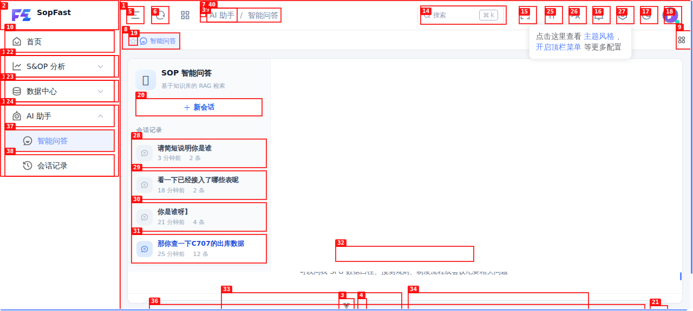
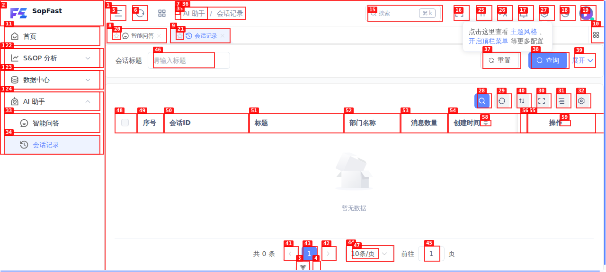
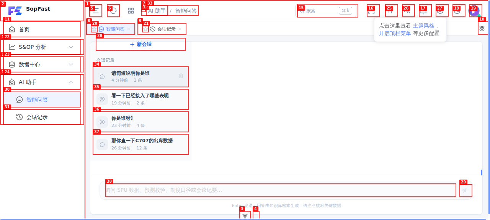
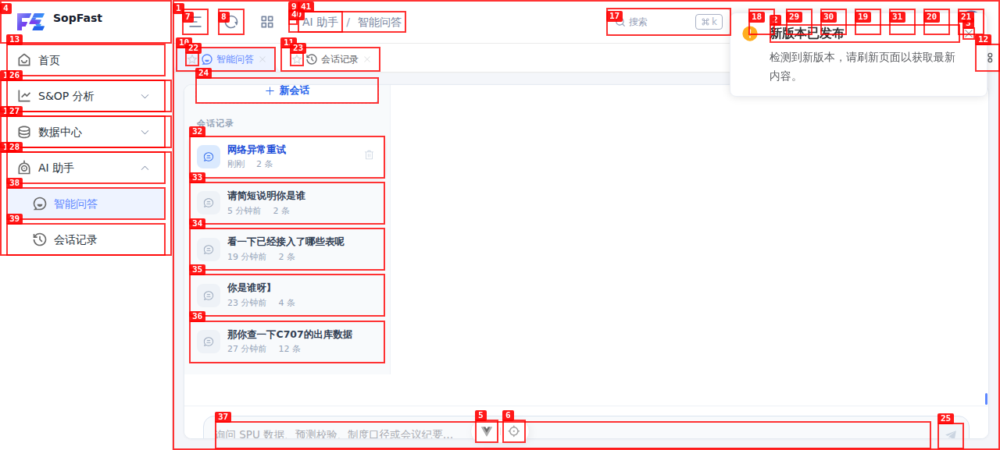
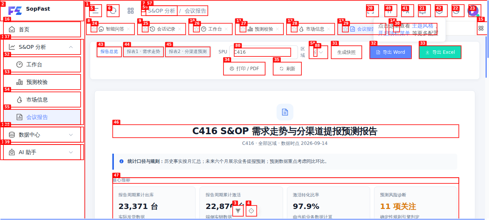
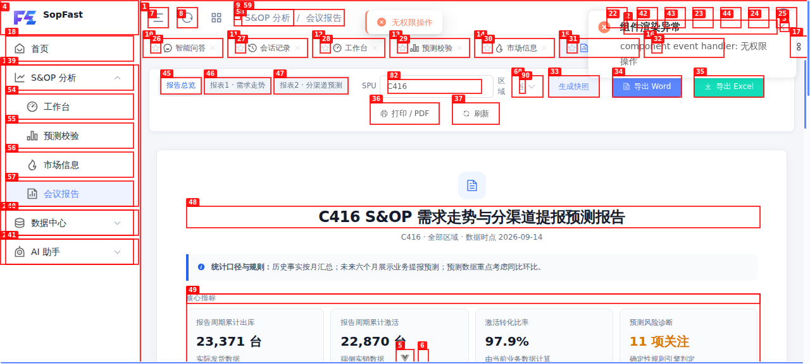

# Dogfood Report: SopFast 用户端

| Field | Value |
|-------|-------|
| **Date** | 2026-09-15 |
| **App URL** | http://127.0.0.1:5180/web |
| **Session** | sopfast-user |
| **Scope** | 普通用户权限、AI 助手、用户端核心页面 |
| **Retest** | 2026-09-15：3 项均已修复并通过普通用户浏览器回归 |

## Summary

| Severity | Count |
|----------|-------|
| Critical | 0 |
| High | 0（已修复 3） |
| Medium | 0 |
| Low | 0 |
| **Total** | **0 未解决 / 3 已修复** |

修复后证据：会议报告权限、会话记录和断网恢复截图分别见
`screenshots/fixed-user-report-permission.png`、`screenshots/fixed-user-memory.png`、
`screenshots/fixed-user-chat-recovery.png`。自动化浏览器回归脚本为 `user-regression.py`。

## Issues

<!-- Copy this block for each issue found. Interactive issues need video + step-by-step screenshots. Static issues (typos, visual glitches) only need a single screenshot -- set Repro Video to N/A. -->

### ISSUE-001: “智能问答”和“会话记录”使用不同会话数据源

| Field | Value |
|-------|-------|
| **Severity** | high |
| **Status** | fixed |
| **Category** | functional |
| **URL** | http://127.0.0.1:5180/web/#/ai-assistant/memory |
| **Repro Video** | N/A（当前环境无 ffmpeg；已提供前后状态截图） |

**Description**

普通用户在“智能问答”左侧能看到 5 条真实 SOP 会话，其中包括刚刚测试创建的会话；进入同一菜单组下的“会话记录”后却显示“暂无数据 / 共 0 条”。网络证据显示前者读取 `/api/v1/sop/chat/sessions`，后者读取 `/api/v1/ai/chat/list`，两套后端存储没有统一。

**Repro Steps**

<!-- Each step has a screenshot. A reader should be able to follow along visually. -->

1. 使用普通用户进入“AI 助手 → 智能问答”，观察左侧已有多条会话。
   

2. 进入“AI 助手 → 会话记录”。
   

3. **观察：**页面显示 0 条，和智能问答会话列表不一致。

---

### ISSUE-002: SSE 请求失败后聊天输入区永久锁定

| Field | Value |
|-------|-------|
| **Severity** | high |
| **Status** | fixed |
| **Category** | functional / ux |
| **URL** | http://127.0.0.1:5180/web/#/ai-assistant/chat |
| **Repro Video** | N/A（当前环境无 ffmpeg；问题已重复复现两次） |

**Description**

当 `/api/v1/sop/chat/stream` 在传输层失败时，界面一直保留流式生成状态，文本框和发送按钮都处于 disabled，且没有恢复按钮。刷新页面才能继续。后端实际上可能已经保存了该轮会话，因此用户重试还可能造成重复提问。

**Repro Steps**

1. 在智能问答页新建会话，并模拟聊天流网络中断。
2. 输入“网络异常测试”并按 Enter。
3. **观察：**文本框和发送按钮均不可用，页面没有恢复入口。
   
4. 刷新后再次执行同样操作，仍可稳定复现。
   

---

### ISSUE-003: 普通用户可见“生成快照”，点击后 403 并触发组件错误边界

| Field | Value |
|-------|-------|
| **Severity** | high |
| **Status** | fixed |
| **Category** | functional / ux / console |
| **URL** | http://127.0.0.1:5180/web/#/sop-analysis/meeting-report |
| **Repro Video** | N/A（当前环境无 ffmpeg；已提供操作前后截图） |

**Description**

“生成快照”是管理员专属权限 `module_sop:report:generate`，但会议报告页对普通用户仍显示并启用该按钮。点击后接口返回 HTTP 403，页面除“无权限操作”提示外还出现“组件渲染异常 / component event handler: 无权限操作”的错误边界告警。

**Repro Steps**

1. 使用普通用户进入“会议报告”，观察工具栏中的“生成快照”按钮可见且可点击。
   
2. 点击“生成快照”。
3. **观察：**`POST /api/v1/sop/report/snapshots/generate` 返回 403，页面出现组件渲染异常。
   
