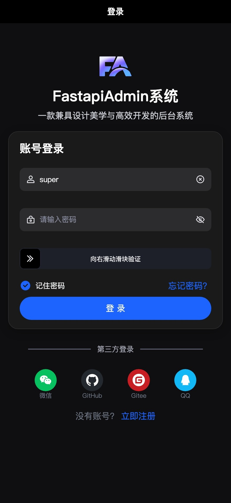
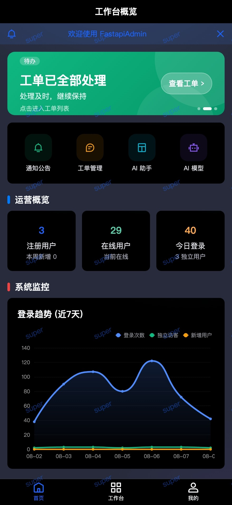
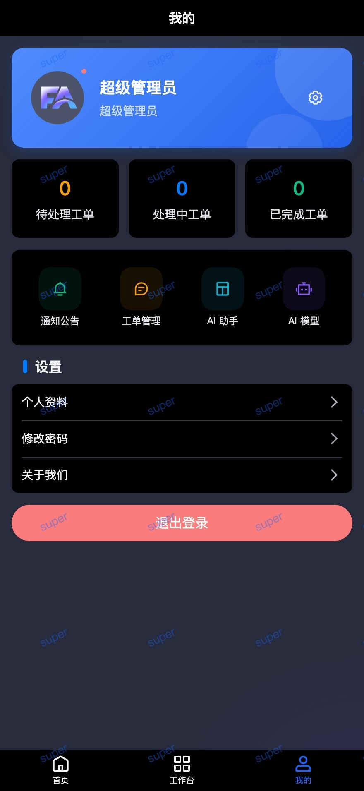

<div align="center">
  <p align="center">
    
  </p>
  <h1 align="center">
    FastApp
    <sup style="background-color: #28a745; color: white; padding: 2px 6px; border-radius: 3px; font-size: 0.4em; vertical-align: super; margin-left: 5px;">v3.1.0</sup>
  </h1>
  <p align="center">
    基于 uni-app + Vue 3 + TypeScript 的现代化移动端跨平台开发模板
  </p>
  <p align="center">
    
    
    
    
    
  </p>
</div>

> **与仓库根文档的关系**：项目总览、一键前后端启动、演示账号、Docker 部署等请以 [根目录 README.md](../../README.md) 为准；**本文档**侧重 `frontend/app/` 移动端开发说明。

## 项目介绍

FastApp 是 FastapiAdmin 项目的移动端应用，基于 uni-app 框架开发，支持一套代码多端运行。采用 Vue 3 + TypeScript + Vite 等现代化技术栈，集成了完善的代码规范和开发工具链，为开发者提供开箱即用的移动端开发解决方案。

## 特性

- ⚡️ [Vue 3](https://github.com/vuejs/core), [Vite](https://github.com/vitejs/vite), [pnpm](https://pnpm.io/), [esbuild](https://github.com/evanw/esbuild) - 就是快！

- 🐂 [Wot UI V2](https://github.com/wot-ui/wot-ui) - 一个轻量、美观、AI友好的 uni-app 组件库

- 🚦 [@wot-ui/router](https://github.com/wot-ui/my-uni) - 适用于uni-app&vue3的轻量级路由库

- 🔄 [Uni Mini CI](https://github.com/Moonofweisheng/uni-mini-ci) - 一个小程序端持续集成的插件

- 🌐 [Alova](https://alova.js.org/zh-CN/) - 极致高效的请求工具集

- 🆒 [Uni Ku](https://uni-ku.js.org/) - 非常酷的 uni-app 插件库

- 📊 [Uni Echarts](https://uni-echarts.xiaohe.ink/) - 适用于 uni-app 的 Apache ECharts 组件

- 🎨 [UnoCSS](https://github.com/unocss/unocss) - 高性能且极具灵活性的即时原子化 CSS 引擎

- 😃 [各种图标集为你所用](https://github.com/antfu/unocss/tree/main/packages/preset-icons)

- 🔥 使用 [新的 `<script setup>` 语法](https://github.com/vuejs/rfcs/pull/227)

- 📥 [API 自动加载](https://github.com/antfu/unplugin-auto-import) - 直接使用 Composition API 无需引入

- 🦾 [TypeScript](https://www.typescriptlang.org/) & [ESLint](https://eslint.org/) - 保证代码质量

## 项目结构

```bash
frontend/app/
├── manifest.config.ts       # 应用配置源文件（构建时生成 src/manifest.json）
├── pages.config.ts          # 页面路由配置源文件（构建时生成 src/pages.json）
└── src/
    ├── api/                 # API 接口定义
    ├── components/          # 全局组件（GlobalDialog / GlobalLoading / SkeletonPage 等）
    ├── composables/         # 组合式函数
    ├── constants/           # 常量定义
    ├── customize-tab-bar/   # 自定义 TabBar（微信小程序）
    ├── http/                # 请求层（alova + uniapp 适配器、拦截器）
    ├── layouts/             # 布局组件
    ├── locales/             # 国际化文案
    ├── pages/               # 主包页面：index / login / work / mine
    ├── router/              # @wot-ui/router 路由配置
    ├── store/               # Pinia 状态管理
    ├── styles/              # 全局样式
    ├── subPages/            # 分包页面
    ├── types/               # TypeScript 类型
    ├── utils/               # 工具函数
    ├── App.ku.vue           # @uni-ku/root 根组件扩展
    ├── main.ts              # 应用入口文件
    └── theme.json           # 主题配置
```

## 在线演示

- 📱 移动端：[https://service.fastapiadmin.com/app](https://service.fastapiadmin.com/app)
- 📖 在线文档：[https://service.fastapiadmin.com/](https://service.fastapiadmin.com/)

## 快速开始

### 环境要求

- **Node.js** >= 20
- **pnpm** >= 9

### 安装与运行

```bash
cd frontend/app
pnpm install

# H5（浏览器直接访问）
pnpm run dev:h5

# 微信小程序（构建后用微信开发者工具导入 dist/dev/mp-weixin）
pnpm run dev:mp-weixin

# App / 其他小程序平台：替换平台名即可，如 dev:app-android、dev:mp-alipay
pnpm run build:h5         # 构建 H5 应用
pnpm run build:mp-weixin  # 构建微信小程序
```

### 其他命令

```bash
pnpm run lint          # ESLint 检查
pnpm run lint:fix      # ESLint 检查并自动修复
pnpm run type-check    # TypeScript 类型检查（vue-tsc）
pnpm run commit        # Commitizen 规范化提交
pnpm run alova-gen     # 根据后端 OpenAPI 生成请求函数与类型
```

## 截图

| 登录 | 首页 | 个人中心 |
| ---- | ---- | -------- |
|  |  |  |

## 鸣谢

- [uni-app](https://uniapp.dcloud.net.cn/) - 跨平台应用开发框架
- [Vue 3](https://cn.vuejs.org/) - 渐进式 JavaScript 框架
- [Vite](https://cn.vitejs.dev/) - 下一代前端构建工具
- [uni-helper](https://github.com/uni-helper) - 感谢 uni-helper 团队为 uni-app 开发体验优化做出的贡献。
- [vitesse-uni-app](https://github.com/uni-helper/vitesse-uni-app) - 感谢 vitesse-uni-app 提供的快速起手项目。
- [uni-ku](https://uni-ku.js.org/) - 感谢 uni-ku 团队为 uni-app 插件生态做出的贡献。
- [wot-ui-intellisense](https://github.com/wot-ui/wot-ui-intellisense) - wot-ui vscode 代码提示插件
- [awesome-uni-app](https://github.com/uni-helper/awesome-uni-app) - 多端统一开发框架 uni-app 优秀开发资源汇总
- [create-uni](https://github.com/uni-helper/create-uni) - 快速创建 uni-app 项目
- [wot-starter-retail](https://github.com/Moonofweisheng/wot-starter-retail) - 基于 wot-ui 的 uni-app 零售行业模板
- [uni-mini-ci](https://github.com/Moonofweisheng/uni-mini-ci) - 一个 uni-app 小程序端构建后支持 CI（持续集成）的插件
- [@wot-ui/router](https://github.com/wot-ui/my-uni) - 一个基于 vue3 和 Typescript 的轻量级 uni-app 路由库
- [uni-ku-root](https://github.com/uni-ku/root) - 一个模拟 App.vue 原有能力的根组件插件
- [uni-echarts](https://uni-echarts.xiaohe.ink/) - 适用于 uni-app 的 Apache ECharts 组件

## 许可证

本项目采用 [MIT](LICENSE) 许可证。

[](https://star-history.com/#fastapiadmin/FastapiAdmin&Date)

---

**如果这个项目对你有帮助，请给一个 ⭐ Star**
